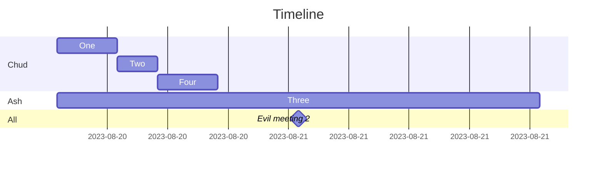

## Oct 25, three nights prior
 - The [[The Player Character Group]] is awakened in [[Louisiana]]
 - Evil meeting with sires and [[Ella]]
	 - [[The Player Character Group]] is sent to NY to investigate [[The Peace]]
 - [[Chud]] drives the party to [[New York]] over the next three nights
## Oct 28, night 1
- The [[The Player Character Group]] arrives in [[New York]]
	- [[Chud]] meets with [[Old Man Chalmers]]
	- [[Alcott Dracul]] is scorned at [[The Brujah]]
	- [[Ash o' Lyn]] puts on a circus in the park and meets with [[Christopher 'Thorne' Leighton]]
	- [[Hasan Ibn Haqim]] checked in at the [[Assamite Blood Bank]]
## Oct 29, night 2
- [[Hasan Ibn Haqim]] and [[Chud]] go to [[The Chantry]] and annoy [[Cong 'The Dominus' Chang]] and get a phone-pictures copy of [[Ethan's Little Black Book on the Unbonding]]
- [[Alcott Dracul]] goes to [[James]]/[[Billy Rubio]]'s [[The Calling]]
- [[Ash o' Lyn]] meets with [[George 'The General' Washington]] (and [[Anthony 'Tony']]) on [[Staten Island]]
	- [[The Player Character Group]] blockades [[Jack Vallens]] from [[The Calling]] at behest of [[George 'The General' Washington]] as communicated to the group by [[Ash o' Lyn]]
		- [[Izumi and Fukuyoko Ito]] parties all night and night with [[Jasper]] at [[Toreador Elysium 1]]
		- [[Chud]] welds himself inside [[Jack Vallens]]' submarine, and wakes up in his haven on [[Rikers Island]]
## Oct 30, night 3
- [[Ash o' Lyn]] meets with [[Dr. Cantor]] at the [[Museum of Nature and Science]]
- [[Chud]] stalks [[Izumi and Fukuyoko Ito]] home, hides some blood coins, and invisibly comes to the calling in her limo
- [[Maximillion]]'s [[The Calling]]
	- [[Ash o' Lyn]] befriends [[Bast, Son of None]]
	- [[Izumi and Fukuyoko Ito]] befriends [[Alexander]] who suggests she speak with [[Christopher 'Thorne' Leighton]] on the subject of gaining control of [[Ward Island]]
## Oct 31, night 4
- [[Izumi and Fukuyoko Ito]] and [[Alcott Dracul]] visit [[Christopher 'Thorne' Leighton]] about [[Ward Island]] takeover
- [[Ash o' Lyn]] plans a ritual/heist of [[The Chantry]] with [[Bast, Son of None]]
- [[Hasan Ibn Haqim]] and [[Chud]] go meet the neighbors [[Old Man Chalmers]] told them about
	- One of them was spying on [[Hell Gate]] and tried to implicate chalmers when caught
- Evil meeting is called and the [[The Player Character Group]] meets with [[Old Man Chalmers]] about the neighbors.
	- [[Chud]] gives [[Old Man Chalmers]] one of [[Jack's Blood Coins]] to learn about [[The Peace]] and [[George 'The General' Washington]]
## Nov 1, night 5
- [[Izumi and Fukuyoko Ito]] goes to the hive and meets with [[Cosimo]] (chair) and [[Franchesca]]
- [[Ash o' Lyn]] and [[Chud]] go steal more than [[100 goats]]
- [[The Chantry Heist]]
## Nov 2, night 6
- [[Izumi and Fukuyoko Ito]] and [[Alcott Dracul]] visit [[Cosimo]] at [[The Hive]]
- The [[The Player Character Group]] trades info with [[Old Man Chalmers]] about [[The Outsiders]]s
- [[Ash o' Lyn]] meets with [[Amy Bluetrail]] and has one of her [[The Bean]]s
## Nov 3-8, night 7-12
- Long ticks
	- [[Ash o' Lyn]] teaches fortitude and learns obfuscate
	- [[Alcott Dracul]] teaches auspex and gather's blood to host [[The Calling]]
	- [[Hasan Ibn Haqim]] teaching obfuscate and learning fortitude
	- [[Chud]] learning auspex and making [[Bloodshine]]
	- [[Izumi and Fukuyoko Ito]] makes shovelheads and learns dominate
## Nov 9, night 13
- [[Izumi and Fukuyoko Ito]], [[Chud]], and [[Alcott Dracul]] visit [[Jamie 'The Oracle' Valiant]]
	- Learned [[Kupala]] is opposed to [[The Outsiders]]s
	- Learned the names of three [[The Outsiders]]s
	- Heard the prophecy of the Liar and the Eagle which references [[The Duel]]
- [[Alcott Dracul]] hosts [[The Calling]] on his new yacht
	- [[Chud]] speaks with [[Amy Bluetrail]] and learns more about outsiders and sees the wrongness of [[Cosimo]] after a hit of her [[Bloodweed]]
	- [[Hasan Ibn Haqim]] gets [[A drop of fairy blood]] from [[Vera]]
	- [[Otto Giovanni]] makes an appearance at [[The Calling]] and pisses off [[Izumi and Fukuyoko Ito]]
	- [[Jack Vallens]] is discovered to be acting as [[Cosimo]]'s mouthpiece and the calling relocates to [[Times Square]]
		- [[George 'The General' Washington]] challenges [[Jack Vallens]] to a duel
- [[The Duel]]
## Nov 10, night 14
## Unsure

## Experiments with graphical representations

